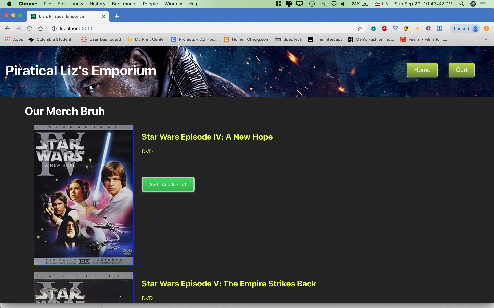
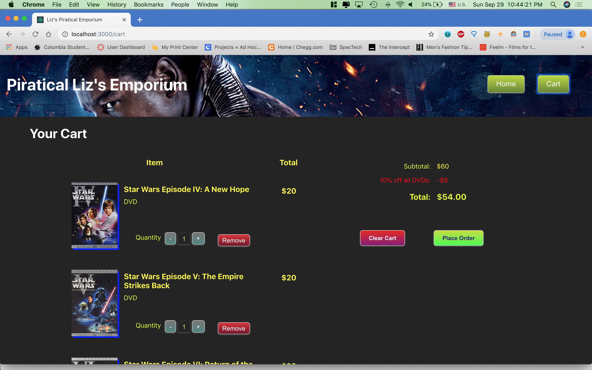

# ClickTime Intern Challenge Question 2

Applicant: Carl Dobrovic, Columbia University '21

## About This Project

This is the app I developed for Question 2 of the 2020
ClickTime Intern Challenge. The app is a simple online
shopping site that features a cart. DVDs and Blu-Rays
of the original star wars movies are available to purchase,
and collecting all copies in each format yields a discount
for those items only. Buying over a hundred copies of anything
yields a 5% discount. 

I implemented this app in React.js since it's the frontend
framework I am most comfortable with. I used Context API for
state management (no Redux woo!) to keep things simple
and easily maintainable. Movie information is brought
into context.js and then fed to the consumers along with
some exposed functions for manipulating state (e.g. 
adding items to the cart).

I routed the pages with the react-router-dom package, putting
the routs within the App.js file. The root of the page displays
the list of products to the user, and the /cart page shows
the cart. 

I thought about implementing bootstrap for styling of the project,
but due to a considerable amount of homework and coding for Columbia
Daily Spectator competing for my time I decided to style each of the
components individually with separate CSS files. I went for a fun
hacked-together but still on-theme look for the pirating site. 

Overall, I had a really fun time putting this app together!

## Building and Running

To build this project, `cd` into the click-time-question-2 directory and run `npm install`.
This should make sure you have react, react-dom, react-router-dom, and react-scripts installed
per the `package.json`.

## Available Scripts

In the project directory, you can run:

### `npm start`

Runs the app in the development mode. 
Open [http://localhost:3000](http://localhost:3000) to view it in the browser.

### `npm test`

Launches the test runner in the interactive watch mode. 
See the section about [running tests](https://facebook.github.io/create-react-app/docs/running-tests) for more information.

### `npm run build`

Builds the app for production to the `build` folder. 
It correctly bundles React in production mode and optimizes the build for the best performance.

See the section about [deployment](https://facebook.github.io/create-react-app/docs/deployment) for more information.

# Thank You

Thank you for the opportunity to show ClickTime
what I can do! I look forward to hearing back soon!

